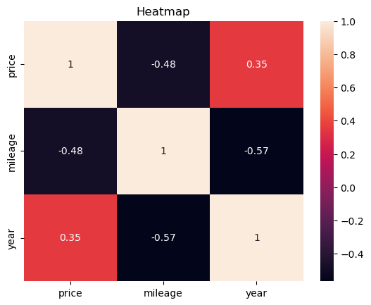
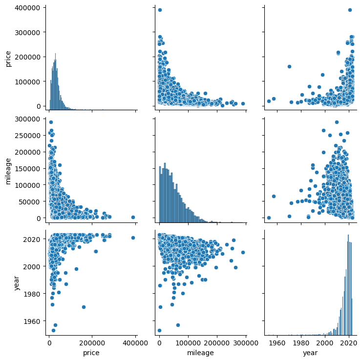
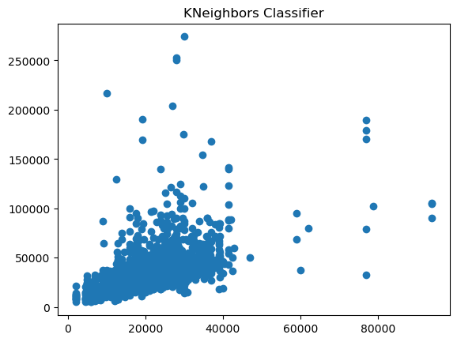
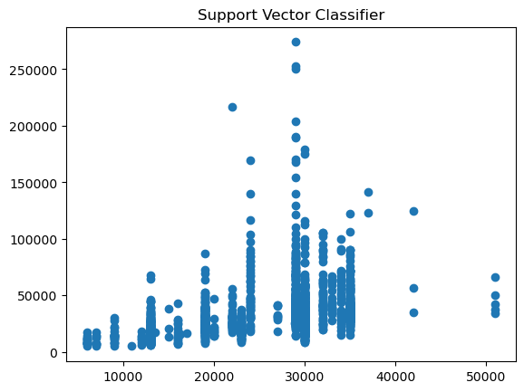
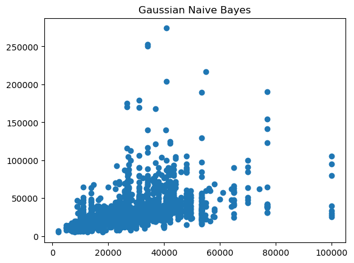
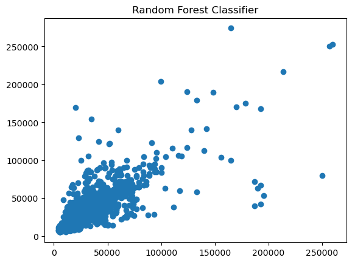

# Project Name

Comparison of some clustering algorithms.

## Table of Contents

- [Dataset Description](#dataset-description)
- [Graphs](#graphs)
- [Preprocessing](#preprocessing)
- [Clustering Algorithms](#clustering-algorithms)

## Dataset Description

The dataset consists of second hand car prices and their features. Dataset taken from kaggle.com

## Graphs

## Preprocessing

Label encoding has been used to convert string values to integer values that can be used in the algorithms.
After label encoding, Standard Scaler has been used the scale the data. Both functions are implemented using sci-kit learn libraries.

## Clustering Algorithms

### KNN

K-Nearest Neighbors (KNN) is a popular and simple classification and regression algorithm used in machine learning. It is a non-parametric algorithm that does not make any assumptions about the underlying data distribution. Instead, it relies on the idea that similar instances tend to have similar labels.

In KNN, the number of neighbors, denoted as K, is a user-defined parameter that determines how many nearest neighbors should be considered for classification or regression. To predict the label or value for a new data point, the algorithm calculates the distance between the new point and all the existing points in the training dataset. The most common distance metric used is the Euclidean distance, but other metrics like Minkowski distance, Manhattan distance, or cosine distance can also be used.

### SVC

Support Vector Machines (SVM) is a powerful supervised machine learning algorithm used for both classification and regression tasks. It works by finding the optimal hyperplane that separates the data points of different classes with the largest margin.

In SVM, the RBF kernel is a popular choice for solving non-linear classification problems. The RBF kernel measures the similarity between two data points based on their radial distance in a higher-dimensional feature space. This kernel allows SVM to learn complex decision boundaries that can effectively separate data points that are not linearly separable in the original feature space.

### Gaussian Naive Bayes

Gaussian Naive Bayes is a simple yet effective probabilistic classification algorithm based on Bayes' theorem with an assumption of independence between the features. It is widely used in machine learning for classification tasks, especially when dealing with continuous numerical data.

The algorithm assumes that the features in the dataset follow a Gaussian (normal) distribution and calculates the likelihood of a particular class based on the probability density function (PDF) of each feature. The "naive" assumption in Gaussian Naive Bayes refers to the independence assumption, meaning that it assumes that the features are conditionally independent given the class label.

During training, Gaussian Naive Bayes estimates the mean and standard deviation for each feature in each class. When making predictions for new data points, it calculates the likelihood of each class based on the Gaussian distribution parameters and selects the class with the highest likelihood as the predicted class.

### Decision Tree

The Decision Tree algorithm works by recursively splitting the dataset based on the values of different features, aiming to create homogeneous subsets of data at each node. The splitting process is determined by selecting the best feature and split point that maximizes the information gain or minimizes the impurity of the resulting subsets. The impurity of a subset can be measured using different criteria, such as entropy, Gini impurity, or classification error.

Entropy is a popular criterion used to measure the impurity of a node in a Decision Tree. It quantifies the uncertainty in the node by calculating the entropy of the class labels present in the node. The goal of the algorithm is to find the feature and split point that minimize the entropy, leading to more pure and homogeneous subsets.

### Random Forest

Random Forest is an ensemble learning algorithm that combines multiple decision trees to make predictions. It is a powerful and popular algorithm known for its robustness and ability to handle complex classification and regression tasks.

Random Forest works by creating a collection of decision trees, each trained on a different subset of the training data and using a random subset of features. During training, each decision tree in the Random Forest is built using a process similar to the Decision Tree algorithm. However, instead of considering all the features at each split, Random Forest only considers a random subset of features, which helps to reduce overfitting and increase diversity among the trees.

The Gini criterion is one of the options for measuring impurity used in the Decision Tree algorithm. It quantifies the impurity or the degree of class mixing in a node. The Gini index measures the probability of misclassifying a randomly chosen element in a node if it were randomly labeled according to the distribution of classes in that node.

